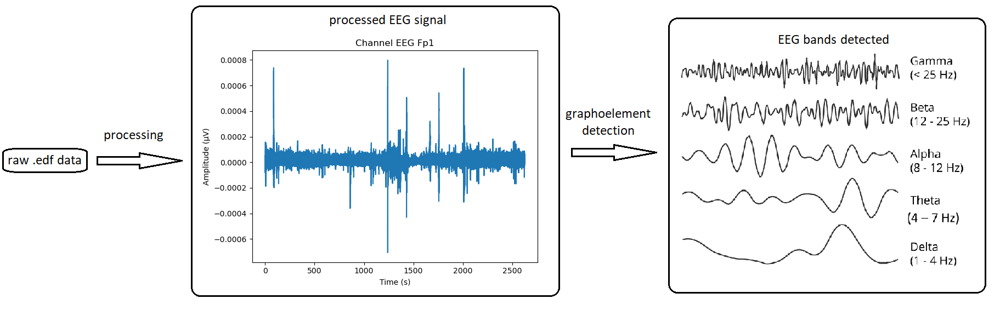
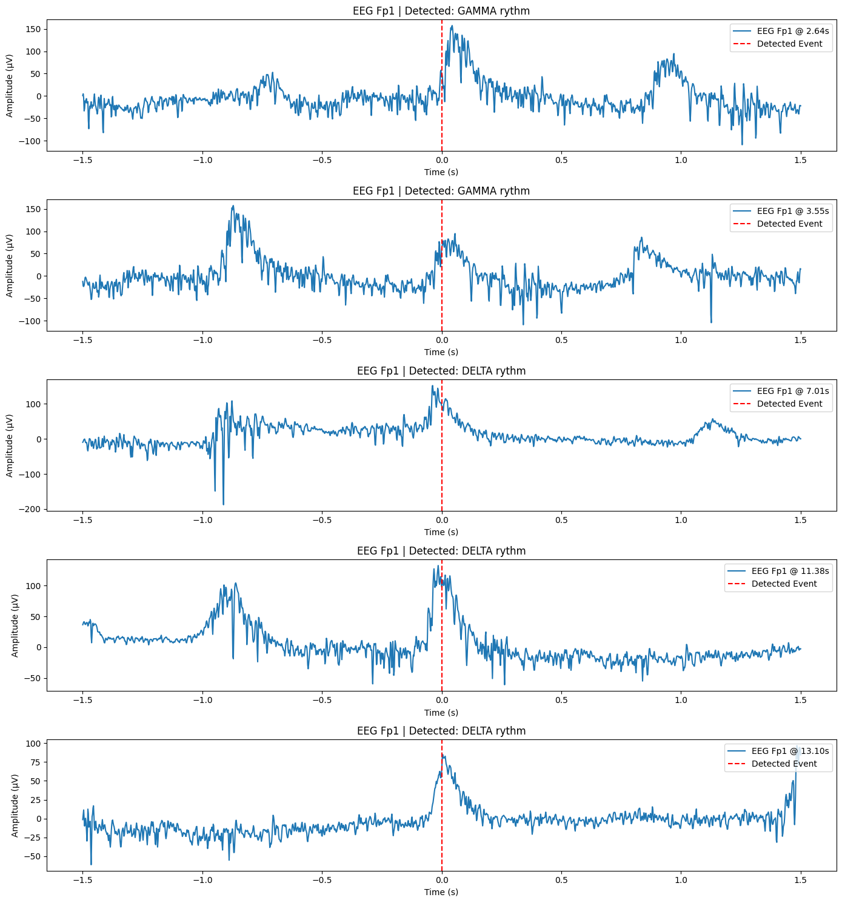

.. EEG Toolbox documentation master file, created by
   sphinx-quickstart on Thu May  8 17:59:03 2025.
   You can adapt this file completely to your liking, but it should at least
   contain the root `toctree` directive.

EEG Toolbox documentation
=========================

This toolbox provides EEG data loading, filtering, normalization,
visualization, detection of EEG bands and Fourier analysis.

Source code available at `https://github.com/hubakukor/scipy_proj`.

A demo notebook showcasing the toolbox is available at `https://github.com/hubakukor/scipy_proj/blob/master/examples/demo.ipynb`.

Introduction
-------
eeg_toolbox is a standardized Python toolkit for processing, analyzing, and visualizing long-term EEG signals. The package allows for the preprocessing of raw EEG data (filtering, resampling), extraction of time-frequency-based features (FFT, STFT), and automatic detection of abnormal brain activity (graphoelements).
The algorithms use open-format EDF files as input and provide a transparent, modular way to evaluate clinically relevant patterns derived from EEG data. The methods used for detection (e.g., spectral peak analysis, frequency band-based dominance) enable the temporal localization and classification of slow waves and unusual activities.
As a result, the package offers a reliable, customizable, and easily expandable solution for analyzing EEG signals for research and educational purposes.

Installation
-------
Install with ``pip install git+https://github.com/hubakukor/scipy_proj.git``

Requirements
-------
Python == 3.10

scipy==1.15.2

matplotlib==3.10.1

mne==1.9.0

numpy==2.2.5

The required libraries are automatically downloaded with the PIP install.

Description
-------

.. toctree::
   :maxdepth: 2
   :caption: Contents:

   modules

Indices and tables
==================

* :ref:`genindex`
* :ref:`modindex`
* :ref:`search`

Authors: Veronika Szabolcsi, Dorka Kecskés, Huba Kukor